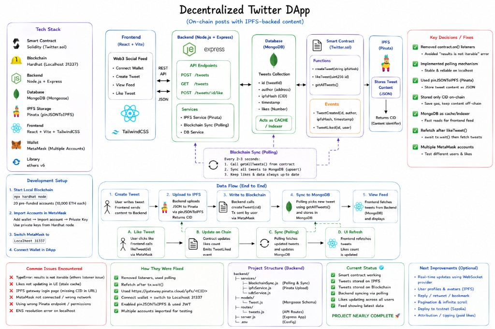

# Web3 Twitter dApp



A decentralized Twitter-like application with:

- Solidity + Hardhat for the smart contract
- React + Web3.js + Tailwind CSS for the frontend
- Node.js + Express + MongoDB for backend caching and indexing
- IPFS via Pinata for tweet content storage

The blockchain remains the source of truth. MongoDB acts only as a cache and indexing layer so every client sees globally synchronized tweets and likes faster.

## 1. Smart Contract

The contract lives in `contracts/Twitter.sol` and supports:

- `createTweet(string ipfsHash)`
- `likeTweet(uint tweetId)`
- `getAllTweets()`
- `TweetCreated` and `TweetLiked` events
- double-like prevention through `hasLiked`

## 2. Backend Layer

The backend lives in `backend/`:

```text
backend/
├── config/
│   └── db.js
├── models/
│   └── Tweet.js
├── routes/
│   └── tweets.js
├── services/
│   └── blockchainListener.js
├── .env.example
├── package.json
└── server.js
```

What it does:

- connects to MongoDB
- replays tweet + like state from the contract
- listens for `TweetCreated` and `TweetLiked` events
- updates MongoDB automatically
- exposes cached tweet APIs for the frontend

Available APIs:

- `GET /health`
- `GET /tweets`
- `GET /tweets/:id`
- `GET /tweets/user/:address`

## 3. Frontend Flow

The frontend now:

- reads the feed from the backend cache
- still creates tweets on-chain through MetaMask
- still likes tweets on-chain through MetaMask
- waits for backend cache sync after each transaction
- polls the backend every 4 seconds by default for near real-time updates

Key frontend files:

- `client/src/App.jsx`
- `client/src/utils/web3.js`
- `client/src/utils/api.js`
- `client/src/utils/ipfs.js`

## 4. Environment Variables

Root `.env` for Hardhat:

```bash
cp .env.example .env
```

Expected values:

```env
SEPOLIA_RPC_URL=
PRIVATE_KEY=
ETHERSCAN_API_KEY=
```

Backend `.env`:

```bash
cp backend/.env.example backend/.env
```

Expected values:

```env
PORT=5001
RPC_URL=
PRIVATE_KEY=
MONGO_URI=
CONTRACT_ADDRESS=
CHAIN_START_BLOCK=0
```

Notes:

- `PRIVATE_KEY` is kept for environment consistency, but the current backend is read-only and never sends likes or tweets itself.
- Set `CHAIN_START_BLOCK` to your deployment block on Sepolia for faster historical reindexing.

Client `.env`:

```bash
cp client/.env.example client/.env
```

Expected values:

```env
VITE_SEPOLIA_CHAIN_ID=11155111
VITE_EXPECTED_NETWORK_NAME=Sepolia
VITE_API_BASE_URL=http://localhost:5001
VITE_TWEETS_POLL_INTERVAL_MS=4000
VITE_IPFS_GATEWAY_BASE=https://gateway.pinata.cloud/ipfs
VITE_PINATA_JWT=
```

## 5. Install

Install root, backend, and client dependencies:

```bash
npm install
npm install --prefix backend
npm install --prefix client
```

## 6. Run Locally

### Terminal 1: Start Hardhat

```bash
npm run node
```

### Terminal 2: Deploy the contract

```bash
npm run deploy:local
```

This updates:

- `client/src/contracts/Twitter.json`
- `client/src/contracts/contract-address.json`

### Terminal 3: Start MongoDB

Run your local MongoDB server however you normally do. Example:

```bash
mongod --dbpath /path/to/your/db
```

### Terminal 4: Start the backend

```bash
npm run backend:dev
```

### Terminal 5: Start the frontend

```bash
npm run client:dev
```

## 7. Deploy to Sepolia

1. Put your Sepolia RPC URL and deployer private key in root `.env`.
2. Run:

```bash
npm run deploy:sepolia
```

3. Copy the deployed contract address into `backend/.env` as `CONTRACT_ADDRESS`.
4. Set `RPC_URL` in `backend/.env` to the same Sepolia RPC.
5. Start the backend and frontend.

## 8. Verification

Verified locally:

- `npm run compile`
- `npm run test`
- `npm run build --prefix client`
- backend files parse with `node --check`
- local backend indexed a real `TweetCreated` event into MongoDB
- local backend indexed a real `TweetLiked` event into MongoDB
- `GET /tweets`, `GET /tweets/:id`, and `GET /tweets/user/:address` returned the expected cached data

## 9. Important Rules

- The smart contract is the source of truth.
- The backend never creates tweets or likes on behalf of users.
- Likes must always go through the smart contract.
- MongoDB is only a cache and indexing layer.
